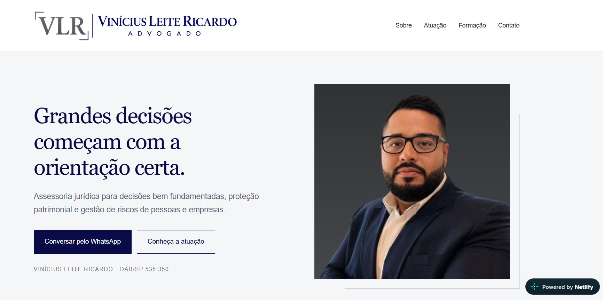

# ⚖️ Website Profissional — Advocacia

Website institucional desenvolvido para apresentação profissional de serviços jurídicos, com foco em presença digital, responsividade e experiência do usuário.

## ✨ Sobre o projeto

- 📱 Layout responsivo para desktop e mobile
- 🎨 Identidade visual profissional
- 🧭 Navegação simples e intuitiva
- 💼 Apresentação das áreas de atuação
- 📞 Integração com contato via WhatsApp
- ⚙️ Estrutura pensada para experiência do usuário

## 🌐 Projeto online

👉 [Acessar o site](https://vinicius-leite-ricardo-adv.netlify.app/)

## 🛠️ Recursos utilizados

## 💡 Desenvolvimento

Projeto desenvolvido desde a estruturação visual até a adaptação para diferentes dispositivos, incluindo organização de conteúdo, identidade visual e otimização da experiência de navegação.
